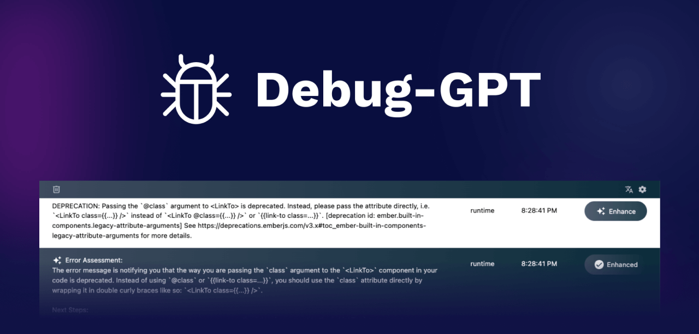

# Debug-GPT - Your AI-Powered Debugging Assistant

Simplify Debugging with Debug-GPT - A Chrome extension leveraging the power of OpenAI LLM to debug the web.
Debug-GPT translates complex error messages into actionable insights for swift issue resolution.

## Requirements
- Google Chrome Browser 88 and above
- [An OpenAI token](https://platform.openai.com/account/api-keys)

## How to Get Started
Follow these steps to get started with Debug-GPT:

**Installation:**
- Install the [Debug-GPT Chrome Extension](https://chrome.google.com/webstore/detail/debug-gpt/gdejebcifoelpfihochmbaoghanjjdbc) from the Chrome Web Store.
- Or run it [locally](#how-to-run-locally) if you are thinking about making some changes.

**Usage:**

- Pin the `Debug-GPT` extension in the taskbar
- Click the the extension icon. You should get confirmation that an extension is debugging the browser.
- Open the Chrome Developer Tools in your browser window (`View>Developer>Developer Tools`) or right-click in your window and select `Inspect`
- Open the `Debug-GPT` panel in the Drawer section of the Developer Tools window.
- Encounter an error message you'd like to understand better.
- Click the `Enhance` button in the error message panel.

**Results:**

Debug-GPT will analyze the error message and provide you with a comprehensible explanation. It will either guide you toward a clear path for resolution or offer suggestions to further investigate the issue.

**Language Translation:**

Debug-GPT supports translations for enhanced accessibility. Select your preferred language from the settings to receive explanations in your chosen language. Keep in mind that OpenAI translation quality can vary depending on the complexity of your errors.
We currently support: English (default), Arabic, Chinese, French, German, Hindi, Italian, Japanese, Korean, Portuguese, Spanish & Thai

## Disclaimer
Debug-GPT leverages OpenAI AI technology to enhance your debugging experience. Before proceeding, please note that clicking the `Enhance` button to generate explanations for your error message will involve sharing your error message with OpenAI. Use this feature only if you're comfortable with sharing the error message with OpenAI, L.L.C.

## License
Debug-GPT is released under the MIT License.

## How to Contribute
- Contributions to Debug-GPT are welcomed and encouraged! Here's how you can contribute:
- Fork this repository to your GitHub account.
- Clone your forked repository to your local machine.
- Create a new branch for your changes.
- Make your enhancements or bug fixes.
- Commit and push your changes to your forked repository.
- Submit a pull request to the main repository following this template

*More information about how to make your first contribution on Github [available here](https://github.com/firstcontributions/first-contributions)*

**Contribute to Discussions:**

Participate in discussions on new features, improvements, or any issues. By contributing to Debug-GPT, you'll be part of a community-driven effort to simplify debugging for developers around the world.

## How to run Locally

- Clone this repo
- Run `yarn install` and `yarn dev`

Then, in Chrome...

- Go to `chrome://extensions`
- Make sure you have `Developer Mode` enabled
- Click `Load Unpacked` and select the `extension` directory of this repository.
- The extension will automatically refresh as you make changes. You can also go back to `chrome://extensions` and click the update arrow to reload the extension.
